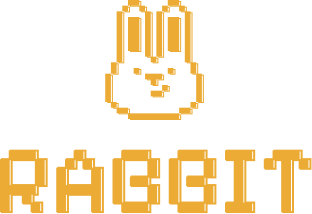

<p align="center">
  
</p>

<h1 align="center">AI Workflow Builder</h1>

<p align="center">
  AI Workflow Builder is a Next.js app for designing node-based business workflows with AI help.
  You can describe a process in plain language, generate or replace the workflow graph, rearrange
  steps on the canvas, and enrich individual nodes with AI-generated operational details.
</p>

## Features

- Generate a complete workflow graph from a natural-language prompt
- Refine an existing graph by sending follow-up instructions in the chat panel
- Drag nodes around the canvas and keep their positions persisted in the browser
- Edit node labels, descriptions, details, and suggestions
- Generate node-specific sheet content for a selected workflow step
- Switch between supported LLM providers and models
- Keep graph state local to the browser between reloads

## Tech Stack

- Next.js 16 App Router
- React 19
- TypeScript
- Tailwind CSS 4
- Dagre for graph layout
- Vercel AI SDK for provider requests

## Supported Providers

The app currently supports these providers and default models:

- `OpenAI`: `gpt-4.1-mini`
- `Claude`: `claude-3-5-sonnet-latest`
- `Groq`: `openai/gpt-oss-120b`
- `Ollama`: `llama3.2:3b`

Additional Groq models are available in the UI, including `openai/gpt-oss-20b` and `llama-3.3-70b-versatile`.

## Getting Started

Install dependencies:

```bash
npm install
```

Create `.env.local` and add the providers you plan to use:

```bash
OPENAI_API_KEY=your_openai_api_key
ANTHROPIC_API_KEY=your_anthropic_api_key
GROQ_API_KEY=your_groq_api_key
OLLAMA_API_URL=http://localhost:11434/api/chat
```

Only the providers you actually use need configuration. Ollama is optional and defaults to a local server.

Start the development server:

```bash
npm run dev
```

Then open `http://localhost:3000`.

## Optional TLS / Enterprise Network Settings

If you run this app behind a corporate proxy or private certificate chain, these optional environment variables are supported by the workflow runtime:

- `WORKFLOW_CA_CERT_PATH`: path to a CA certificate bundle
- `WORKFLOW_FORCE_HTTPS_HOSTS`: comma-separated hosts that should use the configured CA bundle
- `WORKFLOW_ALLOW_INSECURE_TLS=true`: disable TLS verification for provider requests
- `WORKFLOW_ALLOW_INSECURE_CLAUDE_TLS=true`: disable TLS verification only for Claude requests
- `WORKFLOW_INSECURE_TLS_HOSTS`: comma-separated hosts allowed to skip TLS verification
- `WORKFLOW_INSECURE_TLS_PROVIDERS`: comma-separated providers allowed to skip TLS verification
- `CLAUDE_API_URL`: override the Anthropic messages endpoint

Use the insecure TLS flags only for controlled internal environments.

## How It Works

1. The chat panel sends a workflow prompt to `POST /api/workflow/generate`.
2. The server route validates the request, selects the provider/model, and asks the LLM for a structured workflow response.
3. The generated graph is normalized, laid out, and returned to the client.
4. The canvas state is stored in browser local storage so the workflow survives refreshes.
5. When a node needs richer content, the app calls `POST /api/workflow/node-details` to generate concise descriptions, details, and suggestions for that single step.

## Project Structure

- `app/page.tsx`: main workflow builder screen and canvas composition
- `app/api/workflow/generate/route.ts`: full workflow graph generation endpoint
- `app/api/workflow/node-details/route.ts`: node detail generation endpoint
- `hooks/useWorkflowGraph.ts`: graph editing, node movement, and edge updates
- `hooks/useWorkflowGeneration.ts`: client-side workflow generation flow
- `hooks/useWorkflowPersistenceState.ts`: local persistence and restore
- `components/workflow-chatbot.tsx`: prompt UI, provider selection, and chat history
- `lib/workflow-generation.ts`: workflow types, models, schemas, and graph normalization/layout
- `lib/workflow-agent-runtime.ts`: provider runtime, TLS handling, request helpers, and API key resolution

## Development Checks

Run the usual checks before shipping changes:

```bash
npm run lint
npm run build
```

## Notes

- Graph data is persisted in the browser, not in a database
- Non-Ollama providers require valid API keys
- The app expects structured JSON responses from the configured model and validates them before updating the graph
